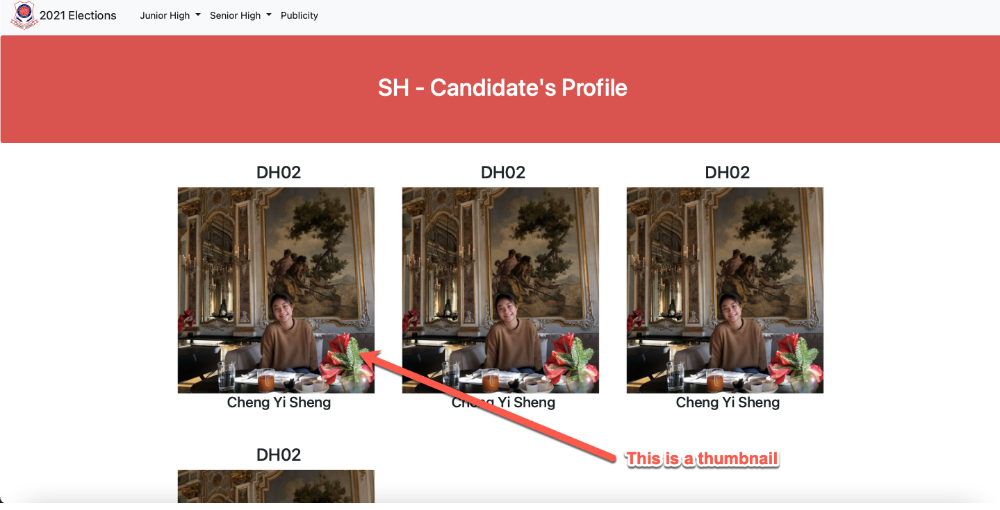
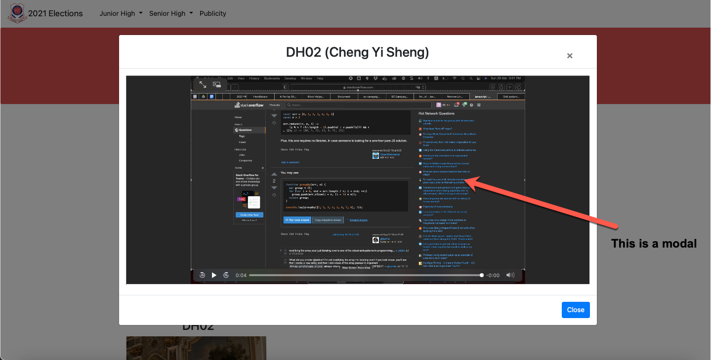

# sc-campaign

View the website at [https://dhs-sc.github.io/sc-campaign/](https://dhs-sc.github.io/sc-campaign/)

---

### How to add new entry

- Update [Student-Data CSV files](https://github.com/dhs-sc/sc-campaign/tree/master/data-processing/data-files) with a new entry
- Add in the corresponding image/video files in the [/thumbnails](https://github.com/dhs-sc/sc-campaign/assets/thumbnails) and [/modals](https://github.com/dhs-sc/sc-campaign/assets/modals) folders.

---

### File size limits:

Note:exclamation:: All uploaded file sizes have to be **smaller than 25mb**. If the file size is larger than 25mb, you can use video compressors like [this](https://www.freeconvert.com/video-compressor) to compress the video to below the size limit.

---

### Upload guidelines

For [/thumbnail](https://github.com/dhs-sc/sc-campaign/assets/thumbnails) folder:

-  The square-ish pictures in the above picture are thumbnails. These pictures are in the [/thumbnail](https://github.com/dhs-sc/sc-campaign/assets/thumbnails) folder.
- Accepted File types: **PNG / JPG**
- File names: _can be anything, as long as there are **no repeated file names**_
- What to update for Student-Data CSV?
  - You need to add in the **file name** _(with file type extension, ie with `.png` or `.jpg`)_ in the respective row and column

For [/modals](https://github.com/dhs-sc/sc-campaign/assets/modals) folder:

- The video/image under the Candidate ID and Candidate Name is a modal. These videos/pictures are in the [/modals](https://github.com/dhs-sc/sc-campaign/assets/modals) folder.
- File types: **PNG / JPG / MP4**
- File names: _can be anything, as long as there are **no repeated file names**_
- What to update for Student-Data CSV?
  - You need to add in the **file name** _(with file type extension, ie with `.mp4` or `.jpg` or `.png`)_ in the respective row and column
- _**Alternative way**: you can also upload the video to some streaming platform for eg: Youtube and paste the link in the CSV instead of the file name._

For Student-Data CSV:

- Upload the csv files at [https://github.com/dhs-sc/sc-campaign/data-processing/data-files](https://github.com/dhs-sc/sc-campaign/tree/master/data-processing/data-files)
  - Please keep the file names the same as the ones currently in the folder, ie **replace the current files**.
  - Please ensure that the encoding of the file is in **utf-8** format.
  - There are currently 3 csv files that needs to be filled:
    - `jh-group-data.csv` which is for JH groups for the Final Presentation Project. Click [here](https://dhs-sc.github.io/sc-campaign/candidates.html?p=fpp&l=jh) to go to webpage.
    - `jh-student-data.csv` which is for JH individual candidates. Click [here](https://dhs-sc.github.io/sc-campaign/candidates.html?p=profile&l=jh) to go to one of the webpages.
    - `sh-group-data.csv` which is for SH groups for the Final Presentation Project.. Click [here](https://dhs-sc.github.io/sc-campaign/candidates.html?p=fpp&l=sh) to go to one of the webpage.
    - `sh-student-data.csv` which is for SH individual candidates. Click [here](https://dhs-sc.github.io/sc-campaign/candidates.html?p=profile&l=sh) to go to one of the webpage.
  - The **groups'/individual candidates' IDs** of the _can be anything, as long as there are no repeats_
  - The **groups'/individual candidates' names** _can be anything or even left blank, as long as there are no repeats_
  - The **groups' description** _can be anything or even left blank, as long as there are no repeats_

---

### Other resources

- Read this to learn [how to upload files to Github](https://docs.github.com/en/github/managing-files-in-a-repository/adding-a-file-to-a-repository).
